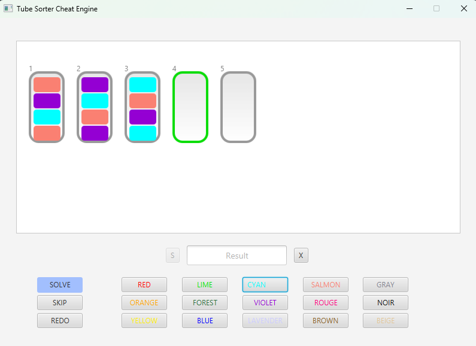
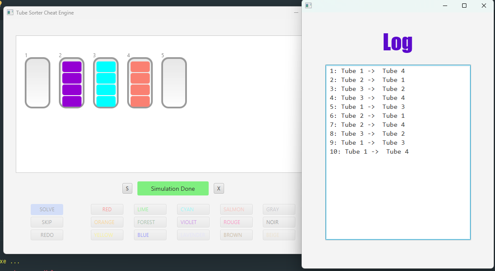

# Tube Sorter Engine

A puzzle engine that sorts layers of liquid inside tubes.  
Implements **Breadth-First Search (BFS)** to compute optimal moves.  

**Features:**
- Limits tube creation to **6 tubes** to optimize memory usage and performance.
- Efficient state exploration using data structures to avoid redundant computations.

**Technologies:** Java, JavaFX

**Demonstration:**
BEFORE

AFTER

